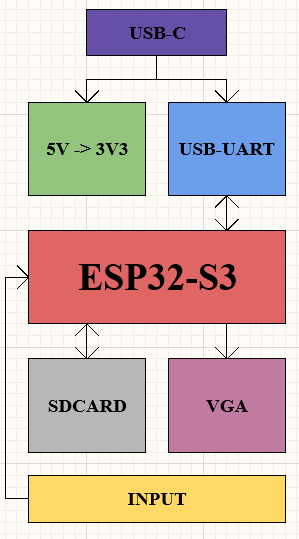
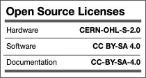

# VESA-ESP Documentation
## Hardware
### Links
The *SCHEMATIC* can be found [here](../Hardware/Main/Manufacturing/Files/Assembly%20Manufacturing/VESA-ESP%20(Manufacturing)%20Schematic.PDF).

The *ASSEMBLY* can be found [here](../Hardware/Main/Manufacturing/Files/Assembly%20Manufacturing/VESA-ESP%20(Manufacturing)%20Assembly%20Drawing.PDF).

The *3D VIEW* can be found [here](../Hardware/Main/Manufacturing/Files/Assembly%20Manufacturing/VESA-ESP%20(Manufacturing)%20PCB%203D%20Printout.PDF).

### Block Diagram

### Main Parts
- ESP32-S3
- USB-UART
- VGA Connector
- USB-C and Power
- Inputs
- SD Card

### How to use it and install it?

## Software/Firmware
### VGA Output
### SD Card Interfacing
### Input interfacing
## Other
### Licenses
