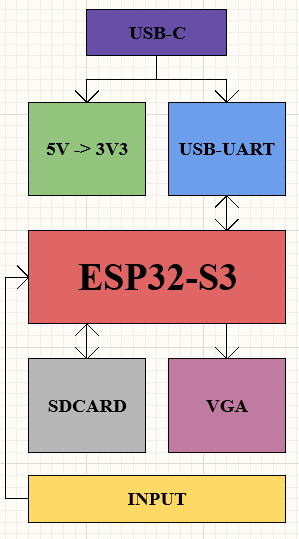
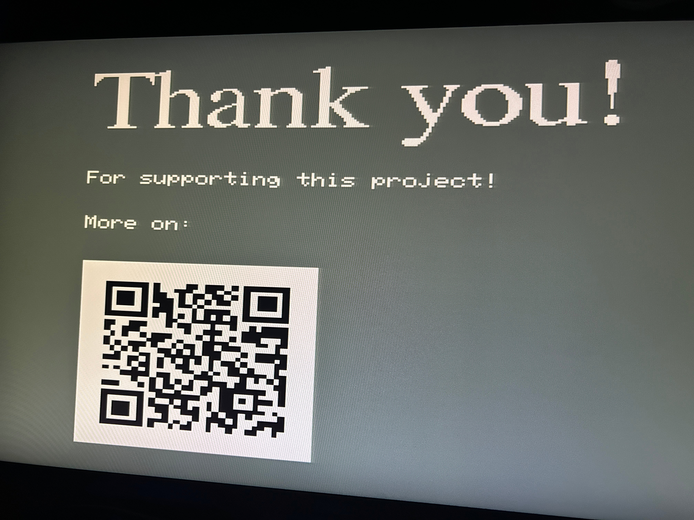
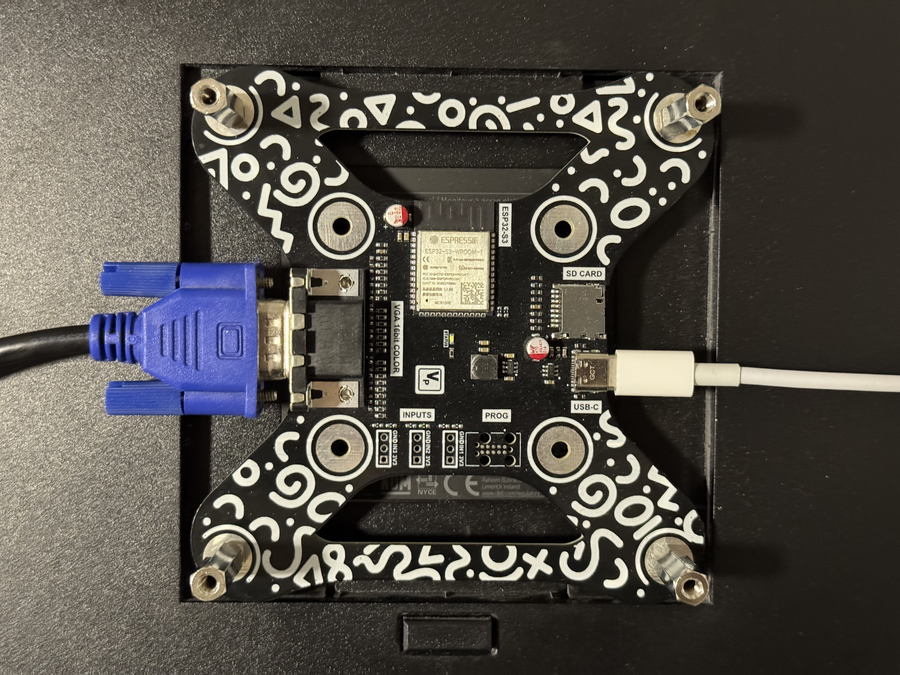
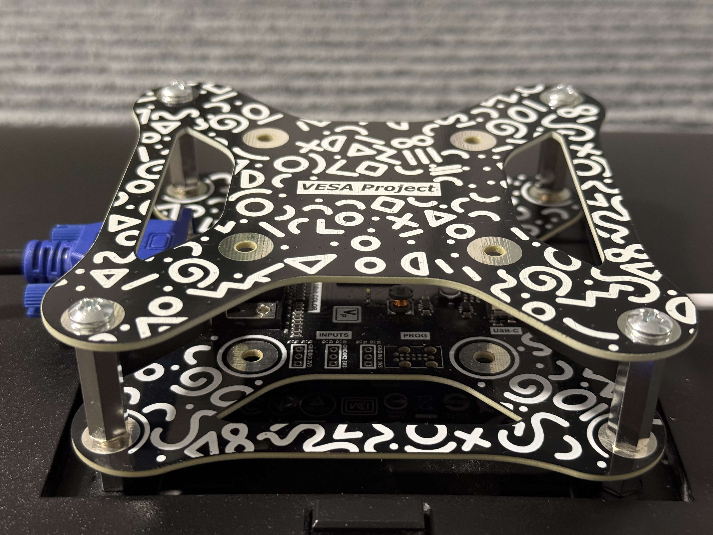
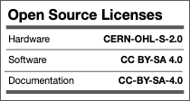

# VESA-ESP Documentation
## Hardware
### Links
The *SCHEMATIC* can be found [here](../Hardware/Main/Manufacturing/Assembly/VESA-ESP%20([No%20Variations])%20Schematic.PDF).

The *ASSEMBLY* can be found [here](../Hardware/Main/Manufacturing/Assembly/VESA-ESP%20([No%20Variations])%20Assembly%20Drawing.PDF).

The *3D VIEW* can be found [here](../Hardware/Main/Manufacturing/Assembly/VESA-ESP%20([No%20Variations])%20PCB%203D%20Printout.PDF).

### Block Diagram

### Main Parts
- ESP32-S3
- USB-UART
- VGA Connector
- USB-C and Power
- Inputs
- SD Card

### How to use it and install it?
- Step #1 VGA: Connect a VGA cable to a VGA compatible monitor/tv
- Step #2 Power: USB-C, 5V
- Step #3 Greeted by welcome message (in case the device was sourced from us, if not, follow the below instructions to flash it)

The device is made so that it can be mounted on the back of monitors using the two groups of screws.

The additional adapter plate is there to allow using stands with the device. 

## Software/Firmware
### Setup the software
- Step #1 Install Arduino: [Install the Arduino IDE](https://www.arduino.cc/en/software/)
- Step #2 Install ESP32: Add https://dl.espressif.com/dl/package_esp32_index.json to the Boards Manager URL in the Preferences ( File -> Preferences)
- Step #3 Install bitluni library: [Intro here](https://github.com/bitluni/ESP32Lib)
- Step #4 Run bitluni or our Examples!
### VGA Output
The VGA output is the main purpose of this device, meaning all examples are using it!

The device should come with a pre-loaded firmware that will showcase some text, thanking for support and a QR code leading to this webpage.

In the [Software/Examples](../Software/Examples/) section there are many examples to get started from. 
### SD Card Interfacing
The example [SD_Test](../Software/Examples/SD_Test/) and [SD_GFX](../Software/Examples/SD_GFX/) is used to showcase the SD Card. 

As shown on the schematic, only 1-bit mode is used to interface the SD-Card, because of the limitation of the ESP32 with OPI PSRAM.
### GPIO interfacing
IO19, IO20, IO47 and IO48 can be used as separate IO on the connector. 

### Licenses
