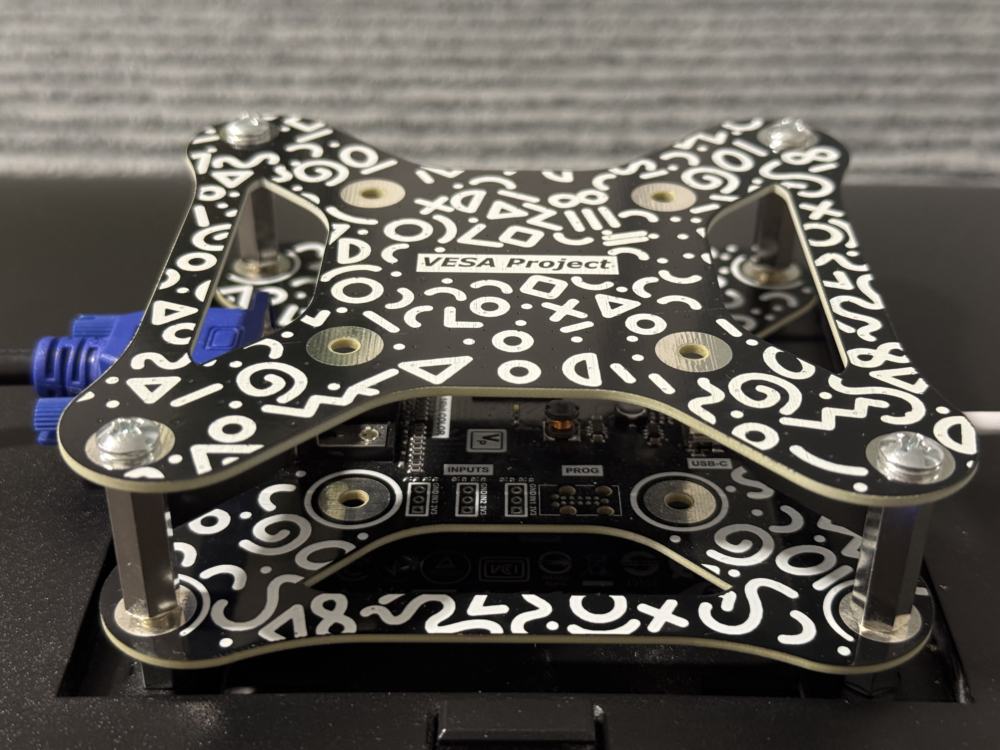

# VESA-Mountable ESP32-S3 with VGA Output



## Overview

This project is a **VESA-mountable ESP32-S3** development board with **VGA output** — a unique and space-saving solution for embedded applications that benefit from graphical displays.

The core idea is simple: create a **microcontroller-based VGA device** that can be easily attached to the back of a monitor using a **VESA-compatible plate PCB**. This results in a clutter-free and elegant hardware setup, ideal for DIYers, educators, and tinkerers.

## Why It’s Cool

- **VGA from a microcontroller**: VGA video from the ESP32-S3 is no small feat.
- **Compact design**: Mounts directly behind your monitor using standard VESA mounting holes.
- **Open Hardware**: Schematics and PCB designs are fully available.

## Shoutout

This project wouldn’t be possible without the incredible work of **[BitLuni](https://github.com/bitluni)**, who developed the groundbreaking library that enables VGA output on the ESP32-S3.

## Project Files

The GitHub repository contains:

- ✅ Schematic files  
- ✅ PCB layout files  
- ⏳ Firmware (coming soon!)

## Mechanical 
Link to the mechanical files for the Revision 1.0 can be found [here](/Hardware/Main/Manufacturing/Revision%201.0/Dimensions.pdf) and additional information can be found [here](/Hardware/Main/Manufacturing/Revision%201.0/Draftsmen.pdf).

## Media Coverage
- 🔗 [Official WebPage](https://silardgal.com/projects/vesaesp.html)
- 🔗 [LinkedIn Post](https://www.linkedin.com/posts/silard-gal_hobby-project-finally-finished-this-activity-7321973185086722048-SGIh?utm_source=share&utm_medium=member_desktop&rcm=ACoAACrF-M4BCWfQST6Wu2K1D1uSqOy6Awv4JLw)
- 🔗 [Hackaday.io Project Page](https://hackaday.io/project/203136-vesa-esp)
- 🔗 [Hackster.io — Gareth Halfacree’s writeup](https://www.hackster.io/news/silard-gal-s-vesa-esp-puts-an-espressif-esp32-s3-on-the-back-of-any-vesa-compatible-display-0b7a13a0985f)
- More coverage coming soon!

## Roadmap

- 📄 Apply for **Open Source Hardware (OSHW)** certification  
- 🛠 Optimize design for manufacturing (DFM)  
- 🛒 Launch for sale  

---

## Folder Structure

```plaintext
├── Hardware/
│   ├── Main/
│   │   ├── Manufacturing/
│   │   │   └── Revision 1.0/
│   │   │       ├── Assembly Manufacturing/
│   │   │       ├── Fabrication/
│   │   │       └── Sources/
│   │   ├── Pcb/
│   │   └── Sch/
│   │
│   ├── Backplate/
│   │   ├── Manufacturing/
│   │   │   └── Revision 1.0/
│   │   │       ├── Fabrication/
│   │   │       └── Sources/
│   │   ├── Pcb/
│   │   └── Sch/
│   │
│   ├── Library/
│   │   └── *.LibPkg, *.PcbLib, *.SchLib
│   │
│   └── Documents/
│       └── logo.png
│
├── Docs/
│   └── IMG_1070.jpg, IMG_1074.jpg, ...
│
├── Software/
│   └── (To be added soon)
│
└── README.md

**Stay tuned!** Firmware and more updates are on the way.
